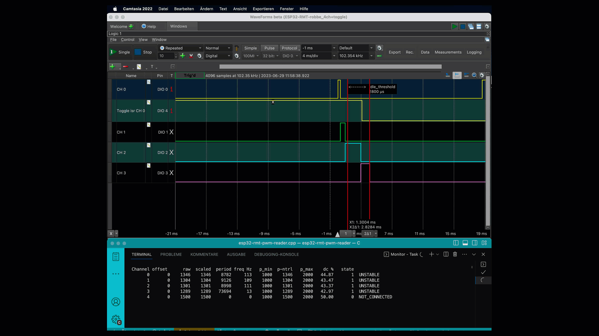

# ESP32 RMT RC PWM Library
## Introduction
**Warning** <br>
This collection of cpp functions is the result of my first involvement with the ESP32 and especially its RMT hardware. Even though it works for me since a while without any problems, But i would not call it a robust plug&play Arduino-ESP32-lib.
It is meant for using the ESP32 with the Arduino Framework **Platform: espressif32@6.1.0** (compatible with older framework espressif32@3.2.0) and was developed with the [Platformio](https://platformio.org/install/ide?install=vscode) extension in [VSCode](https://code.visualstudio.com).
It uses the special hardware component RMT, so it can only be used for ESP32 chips with this component.

### Why did I create this library?

This library was specifically developed for working with older RC receivers, such as the Robbe Luna in my case. These receivers have some unpleasant characteristics compared to modern digital types, which can make it challenging to use them as input devices for microcontrollers. Specifically, these characteristics include:

1. Almost random and chaotic output signals when no transmitter is active. This can be extremely dangerous, especially when controlling motors. (see picture in examples)
2. The PWM frequency may not necessarily comply with the current standards or the technical specifications mentioned in the receiver's manual. This discrepancy can be attributed to aging discrete components that are decades old in some cases.
3. The range of pulse widths (min/max/neutral) can also deviate significantly from the expected values.

The purpose of this library is to address and handle these issues.

- To tackle point 1, a state machine has been implemented to detect whether a signal is stable. The states are categorized as `NO_SIGNAL`, `UNSTABLE`, and `STABLE`. The failsafe function returns `pulse_neutral`, similar to what is commonly done with newer digital receivers. However, unlike those receivers, the library provides the ability to determine whether the transmitter is still active by checking the status.

This is a CPP library for the ESP32-S1 microcontroller that utilizes the RMT hardware to handle RC PWM signals. The library provides the following features:

- Utilization of the RMT hardware to offload the processor.
- Simultaneous reading of up to 8 RC PWM channels.
- Support for reading both raw PWM values (`pwm_get_rawPwm`) and scaled values (`pwm_get_scaledPwm`).
- Scaling of PWM pulse based on predefined constants (or automatic measurement of min/max values), allowing individual adjustment of minimum, neutral and maximum values. (Default: min=1000, neutral=1500, max=2000  all in µs) 
- Separate scaling of the min-neutral and neutral-max ranges. For example, if the min/max calibration defines a min of 800, max of 2100, and neutral of 1200, the range 800-1200 will be scaled to 1000-1500, and 1200-2100 will be scaled to 1500-2000.
- Support for different PWM frequencies per channel (tested range: 20Hz - 200Hz). The phase relationship between channels is irrelevant. Compatibility with various receivers that may be connected to the channels. To avoid uint32_t overflow for lower frequencies, a prescaler must be set.

The library provides the following readings for each channel:

- Pulse width in µs.
- PWM frequency in Hertz (can be different per channel).
- Duty cycle as a percentage based on the actual min/max values.
- Offset in µs, representing the phase shift between the current channel and channel 0. This value is only meaningful if channel 0 and the respective channel operate synchronously (using the same receiver), which is not always the case. Otherwise, 0 is returned.

Each channel has a status associated with it, which is also provided:

- `NO_SIGNAL`: No signal detected on the channel.
- `UNSTABLE`: Unstable signal. For example, when using older RC receivers with no active signal from the transmitter. To be considered stable, the pulse width must fall within the valid range (configurable through constants), and the pulse width of two consecutive pulses must not differ by more than +/-20%. Additionally, the last pulse must not be older than 2 times `period_max` (configurable constant). Only when all conditions are met for multiple consecutive pulses, the signal transitions from UNSTABLE to STABLE. The required number of consecutive stable pulses can be configured through a constant.
- `STABLE`: Standard OK state.

The status of each channel can be manually reset to initiate a new calibration or perform other actions.

The library also supports automatic detection of the neutral position, where the current position is stored as the neutral position upon startup. This behavior can be enabled or disabled through software.

Automatic calibration of the min/max values is supported. During the first 5 seconds after startup, moving the control stick (or equivalent) to the extreme positions will save those values as the min/max values. The calculation of the duty cycle is then based on these values. The duration and the possibility of calibration can be configured through software. Optionally, during calibration, the current PWM value or `pulse_neutral` can be returned.

A failsafe function is implemented, which returns `pulse_neutral` for channels that do not have the STABLE status. However, the status check still allows determining whether the respective channel is receiving a valid signal. This behavior can be configured through a constant.

## How it works
You can find a more detailed description here
[HowItWorks](docs/HowItWorks.md)

## Installation
At this stage it is not a released Arduino Lib. Therefore you have to download the lib files manually and include them in your project.<br>

1. Download the lib-files <br>

lib/esp32-rmt-pwm-reader/esp32-rmt-pwm-reader.h <br>
lib/esp32-rmt-pwm-reader/esp32-rmt-pwm-reader.cpp <br>

2. Copy the files into a lib directory of your project.<br> 
If you are working with PlatformIO, you can use the directory structure of this repository.

## Usage
An example implementation can be found in esp32_pwm_read.cpp. Only the basic steps are shown here.

### Include the Library
```cpp
#include <esp32-rmt-pwm-reader.h>
// #include "esp32-rmt-pwm-reader.h" // if the lib is located directly in the project directory
````

### Initialize
Set which pin to use, configure the default values (if necessary) and start the esp32 rmt-read functionality

```cpp
// init channels and pins
uint8_t pins[] = {13, 14, 33, 27, 32};  // desired input pins
int numberOfChannels = sizeof(pins) / sizeof(uint8_t);

void setup() {
    // init channels
    pwm_reader_init(pins, numberOfChannels);

    // here you can change channel defaults values before reading (if needed)
    // e.g. pwm_set_channel_pulse_min() /max/neutral
    // e.g. set auto_zero/auto_min_max for channel 0-2
    for (int ch = 0; ch < 3; ch++) {
        pwm_set_auto_zero(ch, true);     // set channel to auto zero
        pwm_set_auto_min_max(ch, true);  // set channel to auto min/max calibration
    }

    // begin reading 
    esp_err_t err = pwm_reader_begin();
    if (err != ESP_OK) {
        Serial.printf("begin() err: %i", err);
    }
}

```
### Read the data of interest 
The lib offers many redundant functions for reading the individual data but also access to the complete data structure. Details can be found in the function descriptions in the [esp32-rmt-pwm-reader.h](lib/esp32-rmt-pwm-reader/esp32-rmt-pwm-reader.h).
In [esp_pwm_read.cpp](src/esp32_pwm_read.cpp) different variants are shown.  
```cpp
void loop(){
    // Reading the actual pulse width of channel 1 
    int32_t impulseChannel_2 = pwm_get_rawPwm(2); 

    // Do something with the pulse width...

    // The lib is not blocking. Therefore the read cycle can be 
    // quite high. In esp32_pwm_read.cpp I use 100ms. However, this 
    // should certainly not be necessary with a PWM frequency of 50Hz. 
    // delay() is just as an example. In fact you should use your own 
    // non-blocking task. e.g. like in esp32_pwm_read.cpp
    delay(200); 
}
```

### cleanup
In the vast majority of applications the pwm-reader will be active during the complete application. In this case, a cleanup is not necessary.<br>
However, it may be that the reader is only a partial functionality that should be activated only when needed. This is the case, for example, with ServoTester deluxe.<br>
In this case the Lib must provide for a tidy cleanup, so that the necessary Ressorcen are released. The pwm_cleanup() function does the job.<br>
In this scenario, the initialization cannot simply be done in the setup function, since that is called only once at program startup.
Instead, starting and stopping the PWM reader should be outsourced to separate functions.
In [ServoTester deluxe](https://github.com/rewegit/Servotester_Deluxe) you can see a simple variant for this.

## Examples
The sample application simply outputs a table of the most important values of all channels.
In addition, the most important access types to data and config are shown in the source code.
The table itself is output in the terminal using escape sequences. It is assumed that the default tab width of the shell used is 8 characters. 
If the output is messy, reducing the output speed can help.

```cpp
setup() {
    ...
    // decrase output to every 200ms
    ticker.attach_ms(200, readPwmSignals);  

}
```

Tested on MacOS with VSCode. The integrated shell was ZSH.


 
Transmitter switched off<br>


Transmitter switched on. control stick channel 1 is moved<br><br>

The following data are output:

| output | description |
| ------ | ----------- |
| Channel| channel number 
| offset | distance of the rising edge of the channel to the rising edge of channel 0 in µs
| raw    | currently read pwm value
| scaled | current pwm value scaled to min/neutral/max
| period | period of the channel in µs
| freq Hz | pwm frequency of the channel
| p_min | minimum pwm value preset or determined
| p_ntrl | neutral pwm value preset or determined
| p_max | maximum pwm value preset or determined
| dc | duty cycle calculated with raw and period
| state | current channel status 

Another example shows the integration of the lib in my fork of the [Servotester Deluxe](https://github.com/rewegit/Servotester_Deluxe). 

## History
see [Changelog](docs/Changelog.md)

## License
[MIT License](https://github.com/kapraran/FreqCountESP/blob/master/LICENSE)

## Links
 * [Espressif IoT Development Framework for ESP32](https://github.com/espressif/esp-idf)

## Acknowledgements
For inspiration <br>
 * [Arduino RC engine sound & light controller for ESP32](https://github.com/TheDIYGuy999/Rc_Engine_Sound_ESP32)
 * [Servotester_Deluxe](https://github.com/Ziege-One/Servotester_Deluxe)
 * [Servotester_Deluxe (with improved software)](https://github.com/TheDIYGuy999/Servotester_Deluxe)
