# How it works
Here is a description of how the ESP32 RMT hardware can be used in general for the acquisition of RC PWM signals and how I have implemented this concretely.<br>
I will not go into the question whether it makes sense at all to use RMT for this task (one can be divided on that).

The general description of how the RMT works can be found here:<br>
[Remote Control Transceiver (RMT)](https://docs.espressif.com/projects/esp-idf/en/latest/esp32/api-reference/peripherals/rmt.html) <br>

The RMT of the ESP32-S1 provides 4 interrupts<br>
[RMT Interrups](https://docs.espressif.com/projects/esp-idf/en/v4.4/esp32/api-reference/peripherals/rmt.html#use-interrupts) 

Of these, one interrupt is responsible for receiving data.<br>

The RMT receiver has finished receiving a signal - **rmt_set_rx_intr_en()**

The question is, when is a signal reception finished? The answer can be found here:
[Set RMT RX idle threshold value.](https://demo-dijiudu.readthedocs.io/en/latest/api-reference/peripherals/rmt.html)<br>
**In receive mode, when no edge is detected on the input signal for longer than idle_thres channel clock cycles, the receive process is finished**.<br>

Normally, no periodic signals can be measured completely with this method, since there is no pause between the individual signals that could be used to declare the receiving as finished. This is also true for standard RC PWM signals. However, with the PWM signal we are not interested in the complete signal, but only in the width of the positive pulse of the signal.
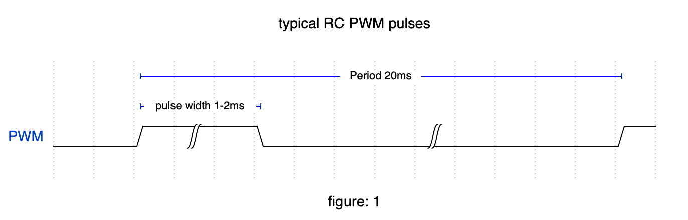

The PWM pulse has a typical length between 1 and 2 ms while the period is typically 20ms. Since we only need the width of the positive pulse, we can stop receiving after the falling edge of the positive pulse (which triggers the interrupt). For this we only need to set the **RMT RX idle threshold value** to a value greater than 2ms.<br>
If the value was smaller, the interrupt could already be triggered within the positive pulse. Then we would not be able to measure it.<br>
Since the minimum and maximum pulse width can have quite high tolerances, especially with old RC receivers, it is recommended to select a sufficiently large value here.<br>
It must also, of course, not be larger than: 
```
max_period - max_puls  
```
Predefined constants are provided for this purpose in the Lib.

```cpp
#define PULSE_MAX_VALID 2300
#define IDLE_TRESHOLD (PULSE_MAX_VALID + 500)  // Receiving is considered finished when IDLE_TRESHOLD us no edge change (ir) occurs.
```
IDLE_TRESHOLD is therefore 2800µs by default. This means that an interrupt is always triggered 2800µs after the falling edge.

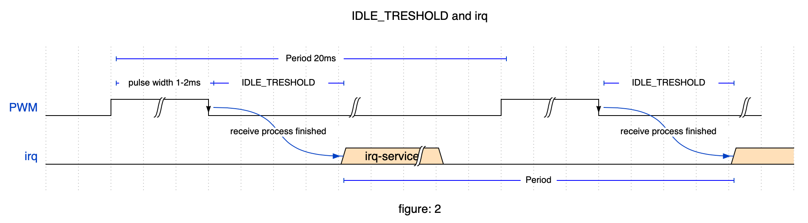

Since IDLE_TRESHOLD is always triggered after the falling edge of the interrupt, the actual period duration can be determined from this. This is simply the distance between 2 following irq of this channel. <br>

**Note**<br>
With this method, it is of course not possible for the RMT hardware to measure the LOW time of the signal, since the irq is triggered within this time. But this is not necessary. If the low_time is needed, it can easily be determined.

```cpp
low_time = period - high_time
```

## Data organization
The data of each channel is stored in a struct pwm_channel.

```cpp
typedef struct pwm_channel {
    uint8_t pin;               ///< GPIO pin for the channel
    uint8_t channel;           ///< RMT channel for the channel
    struct pwm_config config;  ///< Configuration for the channel
    struct pwm_data data;      ///< Data for the channel
} pwm_channel_t;
```
The configuration data and the actual channel data are stored in separate pwm_config and pwm_data structures.
Their exact structure and description can be found in [esp32-rmt-pwm-reader.h](../lib/esp32-rmt-pwm-reader/esp32-rmt-pwm-reader.h) 
The struct of all channels are stored in an array **pwm_channels[numberOfChannels]**.
In addition to writing and reading concrete values via implemented set/get functions, the complete array of pwm_channels can also be accessed (read only).

```cpp
  // read whole array of pwm_channels
  auto pwm_channels = pwm_get_whole_channels_object(); 

  // e.g. rawPwm of channel_2 
  uint32_t rawPwm_2 = pwm_channels[2].data.highus; 
```
It is easier with the set/get functions.

**Note**<br>
For simplicity, RMT_channel numbers are automatically assigned starting with 0 in **pwm_reader_init()**. <br>
If you use less than 8 RMT channels with this lib and have already assigned RMT channels, the assigned channel numbers may have to be corrected. To do this, use the **pwm_set_channel_rmtChannel()** function. <br>
But be careful. The RMT channel numbers must be unique.

## Interrupt handling
In order to keep the actual interrutroutine as short as possible, the processing of the incoming Irq data was separated into a separate control task **pwm_control_task**.<br>
The data is passed to the control task in a queue. For the vast majority of use cases of this lib, a queue is certainly not absolutely necessary, since there is more than 15ms time for processing the data, which is more than sufficient.<br>

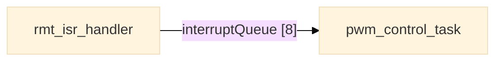
However, it must be considered that in the worst case the irq's of all 8 channels can occur almost simultaneously. This is the case if the offset of all channels is 0 and all channels have the same rawPwm (e.g. everything in neutral).
Besides there could be other tasks with high priority running.
The queue is set to a length of 8. But in the tests I could not see any degradation with a length of 1. If memory is needed, it can be optimized here.<br>
Since the control task needs the channel and the current interrupt time in addition to the actual pulse length, all 3 data were packed into a struct **isr_data**, which is then pushed into the queue.

### Preparation / RMT configuration
**pwm_reader_init()** creates the array of pwm_channels **pwm_channel_t** according to the required channel count and configures the associated input pins.<br>

**pwm_reader_begin()** aqurifies the needed resources and finally starts RMT receive.<br>
It is therefore essential to ensure that configuration changes affecting the RMT configuration (e.g. RMT channel) are made before pwm_reader_begin().<br> 

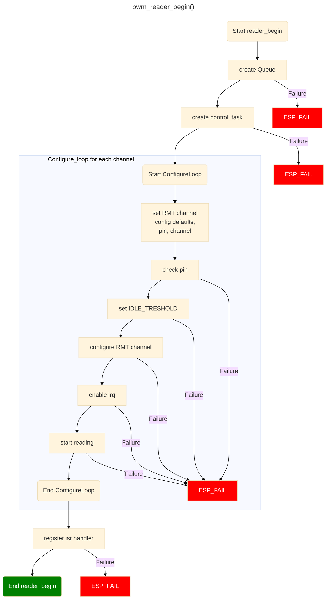


### IRQ splitting

#### rmt_isr_handler
For the isr I measured a runtime of about 6µs.  (for this a measuring pin was toggled with gpio_set_level()). From the measured time must be subtracted then correctly still 2 * gpio_set_level(). 

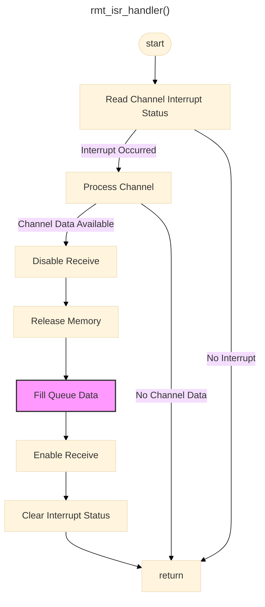

#### pwm_control_task
The actual processing of the data takes place in the control task.

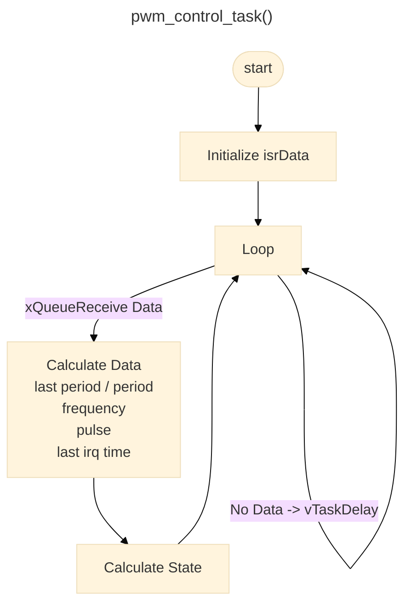


## state machine
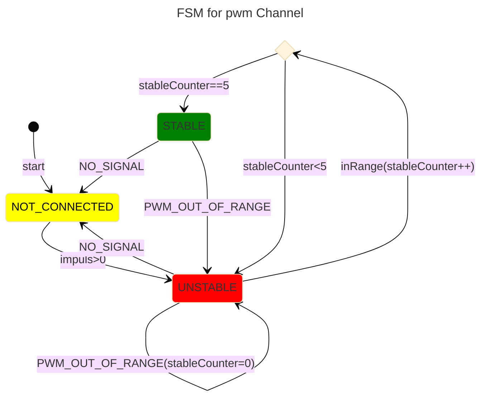
<br>
This state machine calculates the new state of a PWM channel  based on specific conditions. The state can be one of the following: NOT_CONNECTED, UNSTABLE, or STABLE.

The function uses two predefined conditions to check the state:

1. **PWM_OUT_OF_RANGE**: This condition checks if the PWM signal's period (measured in microseconds) is not within the valid range or if successive periods differ by more than 20%, and if the current period of the PWM signal is either 80% or 120% of the previous period. If this condition is met, the state is set to UNSTABLE.

2. **NO_SIGNAL**: This condition checks if a certain time (2 * config.period_max) has elapsed since the last pulse of the PWM signal. If this condition is met, the state is set to NOT_CONNECTED.

The function uses a switch-case to check the current state of the channel and act accordingly:

- If the channel is in the NOT_CONNECTED state, the state is set to UNSTABLE, and the stability counter is reset.

- If the channel is in the UNSTABLE state, it checks if there is no signal (NO_SIGNAL) detected. In this case, the state is set to NOT_CONNECTED. If the PWM signal is out of the valid range (PWM_OUT_OF_RANGE), the state remains UNSTABLE, and the stability counter is reset. If the stability counter reaches the value of STABLE_COUNTER, the state is set to STABLE. Additionally, if config.auto_zero is true, the neutral pulse (pulse_neutral) of the channel is calculated.

- If the channel is in the STABLE state, it checks if there is no signal (NO_SIGNAL) detected. In this case, the state is set to NOT_CONNECTED. If the PWM signal is out of the valid range (PWM_OUT_OF_RANGE), the state is set to UNSTABLE, and the stability counter is reset. If config.auto_min_max is true, the minimum and maximum values of the channel are calculated.

Finally, the new state is stored and returned.

## some key functions

### Determination Pulse neutral
If
```cpp
config.auto_zero == true
````
set for the corresponding channel, the current pulse width of the channel is stored as pulse_neutral in the config of the channel during the transition from UNSTABLE to STABLE.

```cpp
#define ZERO_CALC_LOWER_LIMIT 20  // lower limit in %. current pulse in us - ZERO_CALC_LOWER_LIMIT
#define ZERO_CALC_UPPER_LIMIT 20  // upper limit in %. current pulse in us + ZERO_CALC_UPPER_LIMIT
```
A range of validity can be defined with the defines. By default, the current pulse width at the transition from UNSTABLE -> STABLE may be max 20% of the preset pulse_neutral value.<br>
This is to prevent completely nonsensical values from being stored. E.g. if the corresponding input element was not on center position but on an end position.<br>
A new reading of pulse_neutral can be initiated by resetting the status to UNSTABLE.<br>
This happens automatically when the transmitter is switched off, but can also be initiated via Software. At the same time pulse_neutral can be reset.

```cpp
pwm_set_channel_pulse_neutral(channel, SCALE_PULSE_NEUTRAL);  // reset pulse_neutral
pwm_set_state(channel, PwmState::UNSTABLE);                   // reset state
```

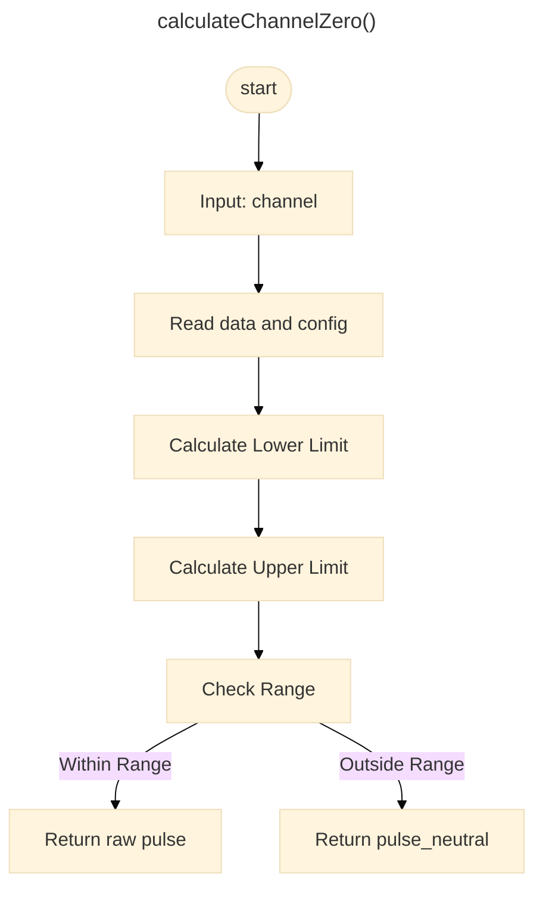

### Determination pulse_min/max

```cpp
config.auto_min_max == true;
````
If set at the corresponding channel, after reaching STABLE the extreme values of the channel pulse_min, pulse_max can be read and stored in the config of the channel.

```cpp
#define MIN_MAX_CALIBRATE_LOWER_LIMIT 20    // lower limit in % based on calculated pulse_min
#define MIN_MAX_CALIBRATE_UPPER_LIMIT 20    // upper limit in % based on calculated pulse_max

#define AUTO_MIN_MAX_CALIBRATE_TIME_SEC 5   // 5 sec for calculate min max
```
With the defines a respective range of validity can be specified. An example calculation can be found here [esp32-rmt-pwm-reader.h](../lib/esp32-rmt-pwm-reader/esp32-rmt-pwm-reader.h) 

After determination of pulse_min, pulse_max config.auto_min_max is set to false, so that the min/max values remain stored, even if e.g. the transmitter is switched off for a short time.<br>
Similar to the determination of pulse_neutral, a new reading of pulse_min, pulse_max can be initiated by software:

```cpp
pwm_set_auto_min_max(channel, true);         // reset config.auto_min_max
pwm_set_state(channel, PwmState::UNSTABLE);  // reset state
```

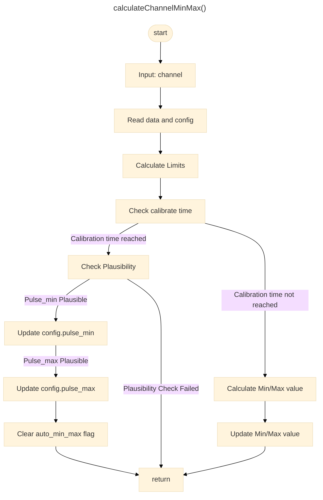
### Determination offset
The offset is defined here as the phase shift of the channel to channel 0. It should not be of great importance in practice, but it is useful e.g. if the channels are to be displayed optically.
To save some memory and computing time, the offset is not determined in the interrupt, but by function **pwm_get_offset()** only when it is needed. However, this also means that the base to which the offset refers (channel 0) may already have changed at the time of the determination. It should actually be older than the currently queried channel.<br>
However, if an ir has just occurred on channel 0, it will have a more recent timestamp than the queried channel. <br>
However, this error is always a full period. The **pwm_get_offset()** function takes this into account by working with modulo for the time difference between channel 0 and the queried channel.<br>
An offset calculation is only done if it is not channel 0 and the pwm frequency of the channel deviates max 2Hz from each other. If the deviation is less than 2Hz, it is considered as jitter and an offset calculation is performed.

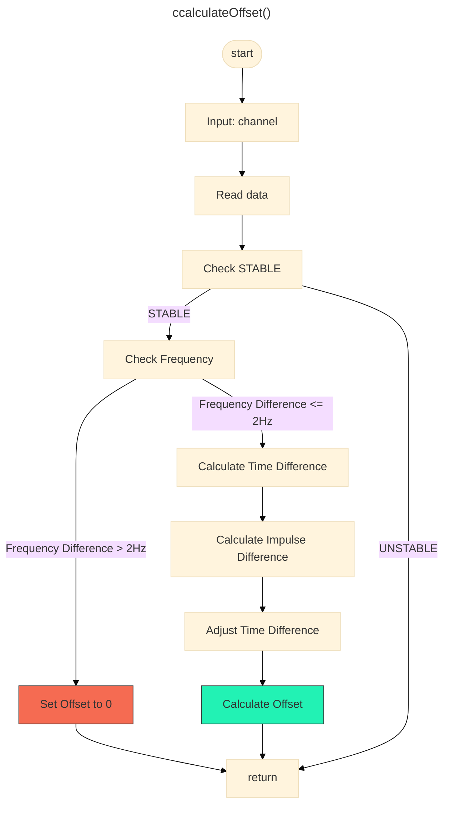

### cleanup
If the lib is only used temporarily in an application, it makes sense to release the used resources (pins, memory, ir) after use. This is done by the function **cleanup()**.

In each loop pass, the RAM address counter for the channel is reset, RX functionality is disabled, memory is released, receiving is stopped, and pin mode is set to default input until all channels are cleaned up. <br>
Then the ISR handler is deregistered, the interrupt queue is cleared, the control task is cleared and finally the array of pwm_channels is cleared. If an error occurs during the process ESP_FAIL is returned.

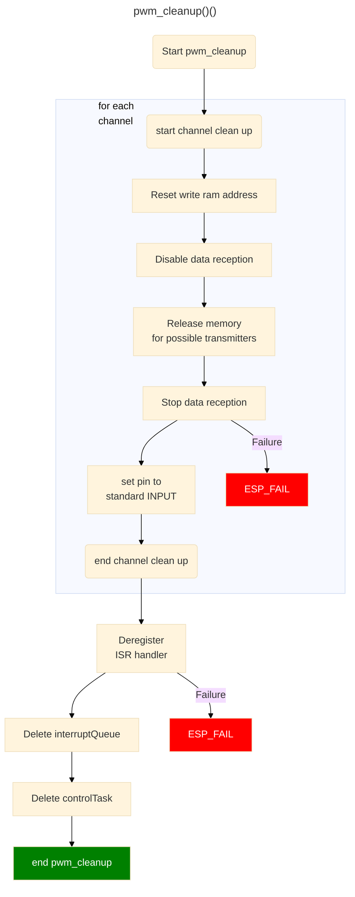
